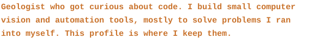
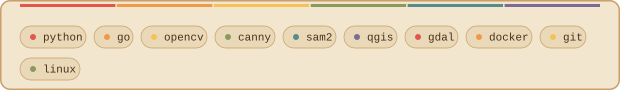
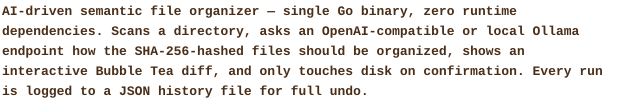
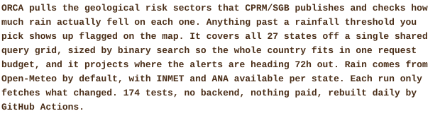
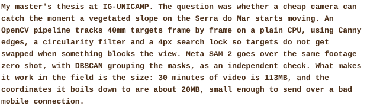
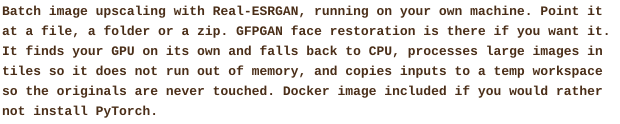
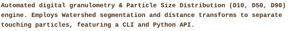

**[declutter](https://github.com/hcristosm/declutter)** &nbsp;·&nbsp; <samp>go, cobra, bubbletea</samp>

**[ORCA](https://github.com/hcristosm/ORCA)** &nbsp;·&nbsp; <samp>python, html, geopandas, streamlit, pytest</samp>

**[Videomonitoramento-de-encostas](https://github.com/hcristosm/Videomonitoramento-de-encostas)** &nbsp;·&nbsp; <samp>python, opencv, sam2</samp>

**[image_batch_upscale](https://github.com/hcristosm/image_batch_upscale)** &nbsp;·&nbsp; <samp>python, real-esrgan, docker</samp>

**[GranuLens](https://github.com/hcristosm/granulens)** &nbsp;·&nbsp; <samp>python, opencv, typer, pytest</samp>

Every graphic on this page is self-contained and rendered directly in the repository—no third-party servers, tracking scripts, or external app wrappers, with one exception: the profile-views badge, which needs to update on every page load and so can't be a static file committed by a daily Action.

* **Design system**: A vintage-cassette palette—warm browns, amber (paper print in light mode, phosphor-CRT amber in dark mode), and a pastel rainbow accent lifted from 70s/80s tape labels—shared by every generator via [`scripts/palette.py`](scripts/palette.py), so the whole page reads as one object instead of a stack of loose images.
* **`ascii.svg`**: Built via [`scripts/make_portrait.py`](scripts/make_portrait.py), pushing character density matrices into an SVG framed like a cassette window (vignette, rainbow spine). It animates line-by-line using native SMIL (`<set>` elements), bypassing GitHub's JavaScript stripping.
* **Section headers (`hd-*.svg`)**: Generated by [`scripts/make_headers.py`](scripts/make_headers.py) as terminal-prompt labels (`» whoami`, `» cat stack.txt`, …) on a tape-label chip, trailing off into a dotted sprocket track.
* **`stack.svg`**: Generated by [`scripts/make_stack.py`](scripts/make_stack.py); the tech list rendered as pills instead of plain text, each tagged with a rotating accent dot.
* **Prose (`tagline.svg`, `bio.svg`, `proj-*.svg`)**: GitHub's markdown sanitizer strips `style` attributes, so plain text can't be recolored inline. [`scripts/make_prose.py`](scripts/make_prose.py) renders the link-free running text as bold, palette-colored SVG instead—project links themselves stay as real markdown anchors.
* **Telemetry Graphics (`stats.svg`, `streak.svg`, `langs.svg`)**: Custom Python scripts ([`make_stats.py`](scripts/make_stats.py), [`make_streak.py`](scripts/make_streak.py), [`make_langs.py`](scripts/make_langs.py)) query GitHub's GraphQL API to compute contribution streaks, commit counts, and language distribution. Language logos ([`lang_icons.py`](scripts/lang_icons.py)) are vendored at build time from [Simple Icons](https://simpleicons.org) (CC0) and embedded directly as path data—no runtime calls to any icon CDN.
* **Contact icons (`social-*.svg`)**: Generated by [`scripts/make_social.py`](scripts/make_social.py) as small vintage-panel chips wrapped in real markdown links—GitHub, LinkedIn and ORCID use vendored Simple Icons brand marks, email and Lattes use generic stroke glyphs.
* **Profile views badge**: The only non-self-hosted graphic on the page—a [komarev.com](https://komarev.com/ghpvc/) badge, since a live per-view counter needs a server that runs on every image request, which a static SVG committed by a daily Action can't do.
* **`cursor.svg`**: A single blinking block cursor (SMIL opacity keyframes) capping the tagline, like a terminal waiting for input.
* **Automation**: Managed by a scheduled GitHub Action ([`.github/workflows/stats.yml`](.github/workflows/stats.yml)) running daily at midnight UTC, committing changes only when stats actually update.
* **Typography**: Everything uses the system monospace stack (`ui-monospace`, `SF Mono`, `Menlo`, `Consolas`, …)—no embedded webfont, so there's nothing for GitHub's sanitizer to strip.
