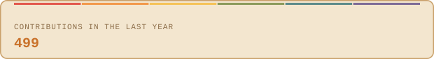
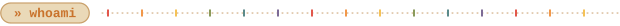
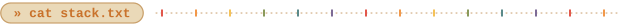
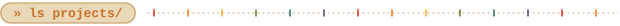
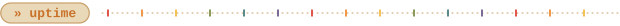
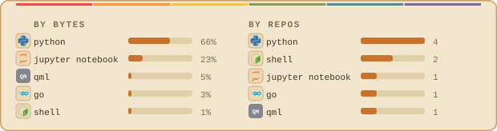
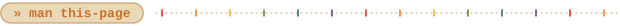

[linkedin](https://www.linkedin.com/in/mateus-leptokarydis/) &nbsp;·&nbsp; 
[github](https://github.com/hcristosm) &nbsp;·&nbsp; 
[lattes](https://lattes.cnpq.br/4735526517901649) &nbsp;·&nbsp; 
[orcid](https://orcid.org/0009-0000-5877-5763) &nbsp;·&nbsp; 
[email](mailto:seu-email@exemplo.com)

> Geologist & M.Sc. Candidate in Geosciences at Unicamp. 
> Practical computer vision and video analysis for slope stability & hazard monitoring.

I combine geological field context with applied computer vision to evaluate and detect early movement onset 
in vegetated slopes. Developed a classical OpenCV pipeline (Canny edge detection, morphological filtering, 
and a 4-pixel kinematic trapping constraint) paired with zero-shot validation via Meta's SAM 2.

<samp>python &nbsp; opencv &nbsp; canny &nbsp; sam2 &nbsp; qgis &nbsp; gdal &nbsp; docker &nbsp; git &nbsp; linux</samp>

**[Videomonitoramento-de-encostas](https://github.com/hcristosm/Videomonitoramento-de-encostas)** &nbsp;·&nbsp; <samp>python, opencv, sam2</samp> 
Low-cost videomonitoring pipeline for slope movement onset detection. 
Employs Canny edge detection, circularity filtering, and a 4px spatial search constraint to track target grids, 
validated against zero-shot Meta SAM 2 segmentation.

**[image_batch_upscale](https://github.com/hcristosm/image_batch_upscale)** &nbsp;·&nbsp; <samp>python, image-processing</samp> 
Batch image upscaling and enhancement script in Python, 
designed to automate super-resolution workflows and image pre-processing.

Every graphic here is generated, not embedded from anyone else's server. 
`ascii.svg` is a photo pushed through a character ramp by 
[`scripts/make_portrait.py`](scripts/make_portrait.py); the stat graphics and 
these section headings are drawn by [a scheduled action](.github/workflows/stats.yml) 
straight from the GitHub GraphQL API, once a day, committing only what changed.

They animate with SMIL inside the SVG, because GitHub strips scripts from 
READMEs — and since nothing loads from a third party, nothing here can 
rate-limit or go dark. The headings are SVGs for the same reason: GitHub also 
strips CSS, so an image is the only way to put this page's own typeface on them.

The typeface is [JetBrains Mono](scripts/fonts), subset to just the characters 
each graphic draws and inlined as base64.
