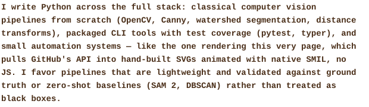
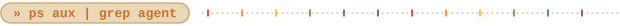

**[declutter](https://github.com/hcristosm/declutter)** &nbsp;·&nbsp; <samp>go, cobra, bubbletea</samp>

**[ORCA](https://github.com/hcristosm/ORCA)** &nbsp;·&nbsp; <samp>python, geopandas, geopackage, leaflet, chart.js, pytest</samp> &nbsp;·&nbsp; [dashboard ao vivo](https://hcristosm.github.io/ORCA/dashboard/)

**[Videomonitoramento-de-encostas](https://github.com/hcristosm/Videomonitoramento-de-encostas)** &nbsp;·&nbsp; <samp>python, opencv, sam2, dbscan</samp>

**[image_batch_upscale](https://github.com/hcristosm/image_batch_upscale)** &nbsp;·&nbsp; <samp>python, real-esrgan, docker</samp>

**[GranuLens](https://github.com/hcristosm/granulens)** &nbsp;·&nbsp; <samp>python, opencv, typer, pytest</samp>

Every graphic here is built and stored in this repo. No third party servers, no tracking scripts, no external app wrappers. The one exception is the profile views badge, which has to update on every page load, so it can't be a static file committed once a day by an Action.

* **Design system**: A vintage cassette palette. Warm browns, amber (paper print in light mode, phosphor CRT amber in dark mode), and a pastel rainbow accent taken from 70s and 80s tape labels. Every generator reads it from [`scripts/palette.py`](scripts/palette.py), so the page looks like one object instead of a pile of loose images.
* **`ascii.svg`**: Built by [`scripts/make_portrait.py`](scripts/make_portrait.py), which turns character density matrices into an SVG framed like a cassette window, with a vignette and a rainbow spine. It draws itself line by line with plain SMIL (`<set>` elements), since GitHub strips JavaScript.
* **Section headers (`hd-*.svg`)**: [`scripts/make_headers.py`](scripts/make_headers.py) writes them as terminal prompts (`» whoami`, `» cat stack.txt`, …) sitting on a tape label chip, trailing off into a dotted sprocket track.
* **`stack.svg`**: From [`scripts/make_stack.py`](scripts/make_stack.py). The tech list as pills instead of plain text, each with an accent dot that rotates through the palette.
* **Prose (`tagline.svg`, `bio.svg`, `collab.svg`, `proj-*.svg`)**: GitHub's markdown sanitizer drops `style` attributes, so there is no way to color plain text inline. [`scripts/make_prose.py`](scripts/make_prose.py) draws the running text as bold SVG in the palette instead. Project links stay as real markdown anchors.
* **Telemetry (`stats.svg`, `streak.svg`, `langs.svg`)**: [`make_stats.py`](scripts/make_stats.py), [`make_streak.py`](scripts/make_streak.py) and [`make_langs.py`](scripts/make_langs.py) hit GitHub's GraphQL API for contribution streaks, commit counts and language distribution. The language logos ([`lang_icons.py`](scripts/lang_icons.py)) are pulled from [Simple Icons](https://simpleicons.org) (CC0) at build time and baked in as path data, so nothing calls an icon CDN at load.
* **Contact icons (`social-*.svg`)**: [`scripts/make_social.py`](scripts/make_social.py) builds small vintage panel chips wrapped in real markdown links. GitHub, LinkedIn and ORCID use vendored Simple Icons marks; email and Lattes use generic stroke glyphs.
* **Profile views badge**: The only graphic not hosted here, a [komarev.com](https://komarev.com/ghpvc/) badge. A live per view counter needs a server running on every image request, which a static SVG committed once a day can't do.
* **`cursor.svg`**: One blinking block cursor (SMIL opacity keyframes) at the end of the tagline, like a terminal waiting for input.
* **Automation**: A scheduled GitHub Action ([`.github/workflows/stats.yml`](.github/workflows/stats.yml)) runs daily at midnight UTC and only commits when the stats actually changed.
* **AI pair-programming**: This page is an example of the workflow above. The generator scripts were written with Claude and with Cline running local models, then read, adjusted and committed by hand. `collab.svg` comes out of the same [`scripts/make_prose.py`](scripts/make_prose.py) as the rest of the text here.
* **Typography**: System monospace stack (`ui-monospace`, `SF Mono`, `Menlo`, `Consolas`, …). No webfont, so there is nothing for GitHub's sanitizer to strip.
